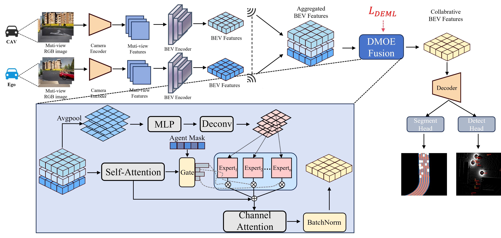

# CoBEVMoE
Heterogeneity-aware Feature Fusion with Dynamic Mixture-of-Experts for Collaborative Perception

## Framework

## Abstract
Collaborative perception aims to extend sensing coverage and improve perception accuracy by sharing information among multiple agents. 
However, due to differences in viewpoints and spatial positions, agents often acquire heterogeneous observations. Existing intermediate fusion methods primarily focus on aligning similar features, often overlooking the perceptual diversity among agents. To address this limitation, we propose \textbf{CoBEVMoE}, a novel collaborative perception framework that operates in the Bird’s Eye View (BEV) space and incorporates a Dynamic Mixture-of-Experts (DMoE) architecture. In DMoE, each expert is dynamically generated based on the input features of a specific agent, enabling it to extract distinctive and reliable cues while attending to shared semantics. This design allows the fusion process to explicitly model both feature similarity and heterogeneity across agents. Furthermore, we introduce a Dynamic Expert Metric Loss (DEML) to enhance inter-expert diversity and improve the discriminability of the fused representation. Extensive experiments on the OPV2V and DAIR-V2X-C datasets demonstrate that CoBEVMoE achieves state-of-the-art performance. Specifically, it improves the IoU for Camera-based BEV segmentation by ${+}1.5\%$ on OPV2V and the AP@50 for LiDAR-based 3D object detection by ${+}3.0\%$ on DAIR-V2X-C, verifying the effectiveness of expert-based heterogeneous feature modeling in multi-agent collaborative perception.

## Visualization
[点此下载高清 Demo (MP4)](demo_open.mp4)
